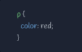
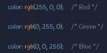

# Practice: Creating a Webpage building upon HTML basics and understanding how to use CSS

## Understanding selectors and properties to bring styling with colors, fonts, sizing, layouts, and much more...

### Practce understanding CSS Colors

-   [ ] Simple practice to gain a better understanding of the power of adding CSS Styling to a webpage and how it can make it uniquely beautiful
    -   [ ] CSS or Cascading Style Sheet, is a language that paints a website with colors, fonts, layouts, and animations.
    -   [ ] CSS is used to create stunning webpages.
    -   [ ] It can enhance the user experience, and can make a webpage unquie and stand out amongst the rest.
    -   [ ] It is absolutely beautiful to see a webpage come to life and become even more beautiful.

-   [ ] Every rule begins with a selector then followed by curly brackets {}
    -   [ ] Inside the curly brackets, declarations are made of property:value pairs seperated by a colon.
    -   [ ] Each line will end with a semicolon ; .
    -   [ ] CSS files have as many rules as desired. Even most webpages commonly used could have several hundres of CSS rules for it.

-   [ ] CSS Selectors are used to determine which CSS elements are styled
    -   [ ] The most common type of selectors is the following:
        -   [ ] Type Selectors:
            -   [ ] Selects all the matching elements on the webpage for styling
    -   [ ] HTML elements can be selected by their HTML attributes
        -   [ ] Selecing an element by "class" is done by using a period ".", and can be used to style multiple elements with a matching "class" attribute
        -   [ ] Selecting an element by "id" is done by using a hashtag "#", and is used to style a single element with a matching "id" attribute.
    -   [ ] Instead of selecting every element with a matching class only "div" elements that either have a class of "class-name" or an "id" of "id-name".
        -   [ ] This selection is known as "targeting"

-   [ ] Pseudo-elements:
    -   [ ] This makes it possibke to style specific parts of an element, without having to render a new HTML
        -   [ ] The "pseudo" part just means giving CSS to a specific piece of the content.
    -   [ ] These are a few use cases for pseudo-elements
        -   [ ] Creating decorations to go with lables or text
        -   [ ] Styling the first letter or first line of a paragraph
        -   [ ] Making custome tooltips that appear as you hover your mouse over something
        -   [ ] And even more!!!
        -   [ ] For instance, including an emoji before or after some parapgraph text, but not including it inn HTML

-   [ ] CSS Colors:
    -   [ ] Styling the webpage with coloes can help make it even more beautiful and unique
        -   [ ] To add color to text, use the color property
        -   [ ] 
    -   [ ] RGB is another way to customize colors
        -   [ ] It represents the intensity of the red-ness, green-ness, and blue-ness of the color(s) assigned to a given element
        -   [ ] The rgb( ) function accepts three integers ranging from 0 to 255 (0 has no intensity and 255 has maximum intensity), and is assigned to the "color" property:
            -   [ ] 
        -   [ ] Hexicdecimals aka hexicode can be used alterenitavely to express colors that begins with a hashtag (#), followed by a combination of numbers (0 - 9) and letters (a - f).
            -   [ ] The letters in hexidecimals can be either lowercase or uppercase, but mixing them are not best practice.
            -   [ ] 

-   [ ] The &lt;header&gt; element:
    -   [ ] Is used for the beginning of the webpage
    -   [ ] Houses the title of the webpage along with Logos
    -   [ ] The &lt;img&gt; element:
        -   [ ] Is used for all the images on the webpage

-   [ ] The &lt;br&gt; element:
           -  [ ] Creates a new line in your code and forces whatever comes after to start on a new lin

-   [ ] The &lt;hr&gt; element:
    -   [ ] Adds a horizontal line or dividing line across the webpage
    -   [ ] Used to separate sections or different topics on a webpage

-   [ ] The &lt;main&gt; element:
    -   [ ] Is where the main information of the webpage will go
    -   [ ] The &lt;section&gt; element:
        -   [ ] This groups together pieces of similar information

-   [ ]  The &lt;footer&gt; element:
    -   [ ]  This element tends to finish off the webpage as it is located at the very bottom of the webpage and is the last set of items that will be seen
    -   [ ] For instance:
        -   [ ] A footnote on the webpage
        -   [ ] Links to different sections of the webpage
        -   [ ] A copyright symbol for copyright information
            -   [ ] & copy; -> is the symbol for copyright
        -   [ ] A link to external sources using the "href" attribute of the &lt;a&gt; element for the links in the list item to external sources
            -   [ ] &lt;a href="/privacy"&gt;Privacy&lt;/a&gt;
                -   [ ] Use the target attribute to open the link path in a new tab instead of the current page
                -   [ ] <a href="/privacy" target="_blank">Privacy</a>
                -   [ ] When the user clicks one of these external links, they would be redirected to a new page with the informat ion

-   [ ] Encompass:
    -   [ ] HTML
    -   [ ] CSS
-   [ ] HTML:
    -   [ ] Will be the structure and skeleton of how the app will appear on the webpageWill be the structure and skeleton of how the app will appear on the webpage
-   [ ] CSS:
    -   [ ] Encompass the style of the app and give it some flair
